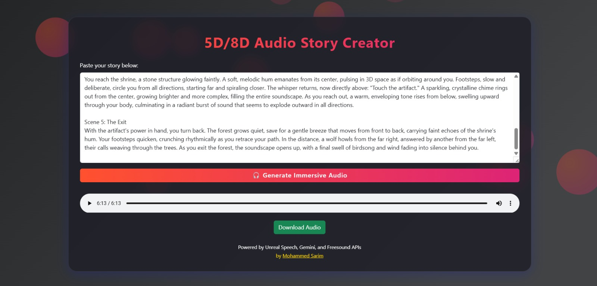

# 5D Audio Story Processor

This project creates an immersive audio experience by converting text stories into spatial audio with 5D/8D effects. It uses AI-powered text-to-speech conversion combined with advanced audio processing techniques to create a unique listening experience.

> **🎧 For the best experience, use headphones!**  
> Enjoy true left/right separation, swirling effects, and a sense of space that standard speakers can't deliver.

---

## Features

- Text-to-speech conversion using Unreal Speech API
- Multiple character voices support
- Spatial audio effects (5D/8D) with dynamic left/right panning
- Reverb and normalization
- Dynamic panning for immersive experience
- Automatic SFX detection and mixing (rain, fire, beast, etc.)
- Modern web UI (Flask + Bootstrap, glassmorphism, animated background)
- Progress indication and in-browser audio playback/download

---

## 🎵 Sample Audio

Listen to a sample immersive audio story:  
[▶️ Sample.mp3](Sample.mp3)

---

## Prerequisites

- Python 3.10 or higher
- Unreal Speech API key
- (Optional) Gemini API key for advanced story cleaning
- (Optional) Freesound API key for SFX fetching

---

## Installation

1. Clone this repository:
   ```bash
   git clone <repository-url>
   cd Audio-5D
   ```

2. Install required packages (with [uv](https://github.com/astral-sh/uv) for fast installs):
   ```bash
   uv pip install -r requirements.txt
   ```
   Or with pip:
   ```bash
   pip install -r requirements.txt
   ```

3. Set up your `.env` file:  
   Copy `.env.example` to `.env` and fill in your API keys:
   ```
   UNREAL_SPEECH_API_KEY=your_unreal_key
   GEMINI_API_KEY=your_gemini_key
   FREESOUND_API_KEY=your_freesound_key
   ```

---

## Usage (Python)

1. Import the AudioProcessor class:
   ```python
   from audio_processor import AudioProcessor
   ```

2. Create an instance with your API key:
   ```python
   processor = AudioProcessor(api_key='your_api_key_here') 
   ```

3. Process a story:
   ```python
   story = """
   Narrator: In a world of endless possibilities...
   Male Character: I've discovered something extraordinary!
   Female Character: What could it be?
   Narrator: The air crackled with excitement as they gathered around.
   """

   processed_audio = processor.process_story(story)
   processor.save_audio(processed_audio, 'output_story.mp3')
   ```

---

## Web App (Recommended)

1. **Run the web app**
   ```bash
   uv run app.py
   ```
   Or, if using Flask's built-in server:
   ```bash
   python app.py
   ```
   Then open [http://127.0.0.1:5000](http://127.0.0.1:5000) in your browser.

2. **Paste your story** into the text area.
3. Click **"Generate Immersive Audio"**.
4. Wait for processing (button disables, spinner shows).
5. **Listen** to the result or **download** the audio file.

---

## Customization

You can customize various aspects of the audio processing:

- Voice selection for different characters
- Spatial effect parameters (panning speed, depth, etc.)
- Reverb settings
- Audio quality settings

Check the `audio_processor.py` file for available options and parameters.

---

## Technical Details

The project uses several audio processing techniques:

1. **Text-to-Speech Conversion**
   - Utilizes Unreal Speech API for high-quality voice synthesis
   - Supports multiple voices for different characters

2. **Spatial Audio Processing**
   - Dynamic panning for 5D/8D effect (audio moves around your head)
   - Customizable oscillation rate
   - Stereo enhancement for true left/right separation

3. **Audio Effects**
   - Reverb for depth and atmosphere
   - Volume normalization
   - Cross-fading between segments

---

## Screenshots



---

## API Keys

- **Unreal Speech**: For TTS audio generation.
- **Gemini**: For story cleaning (optional, fallback is local cleaning).
- **Freesound**: For SFX fetching.

**Never commit your `.env` file!**  
It is already included in `.gitignore` for your safety.

---

## Credits

Made with ❤️ by [Mohammed Sarim](https://github.com/exc33ded).

---

## License

MIT License

## Contributing

Contributions are welcome! Please feel free to submit a Pull Request.